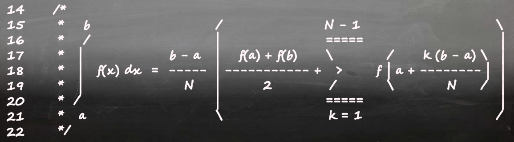
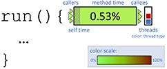
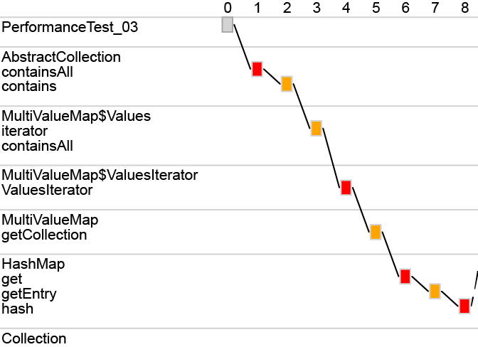
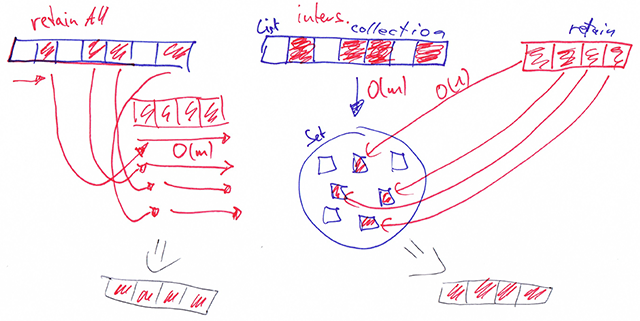

## 2017/18

 

  
 

  
 

  Formula Code:  Source Code that Implements a Mathematical Formula
 

## 2014/15

<!--
  

-->
 

  
 

<!--
  

   
   
  

-->
  
 

   Navigate, Understand, Communicate:  How Developers Locate Performance Bugs
 

